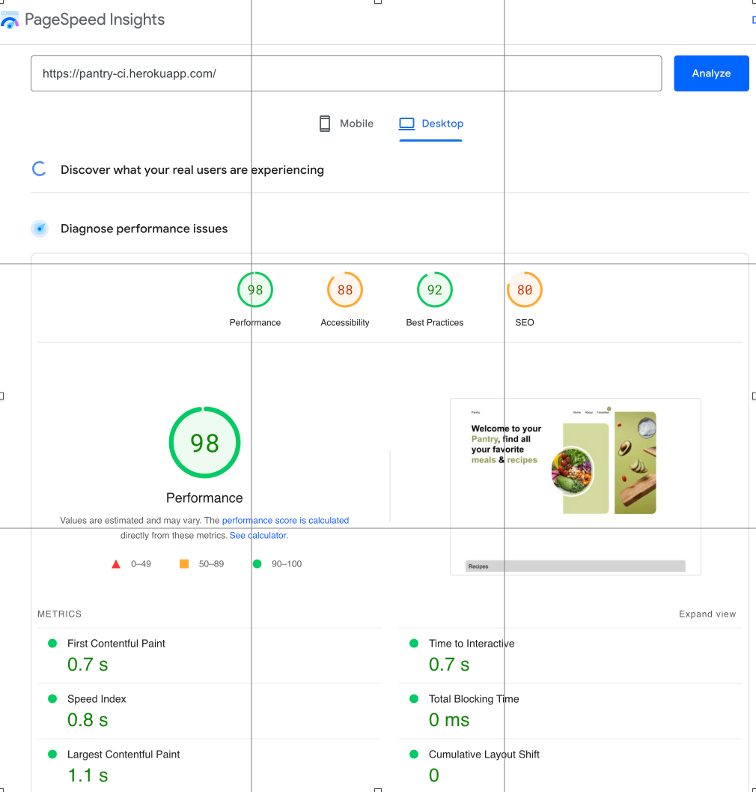
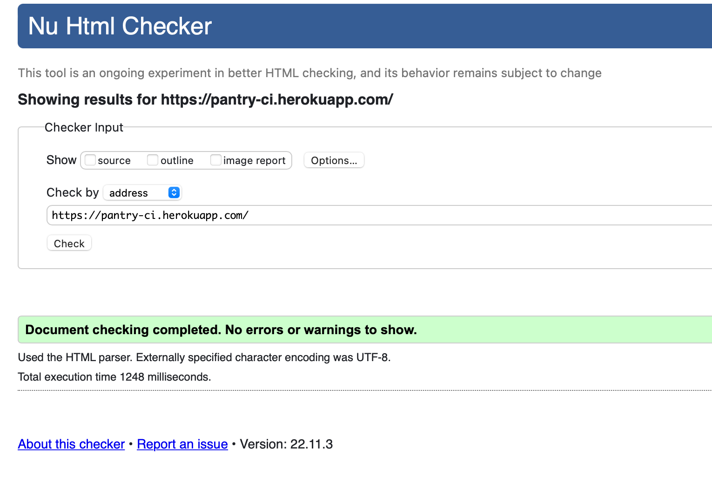
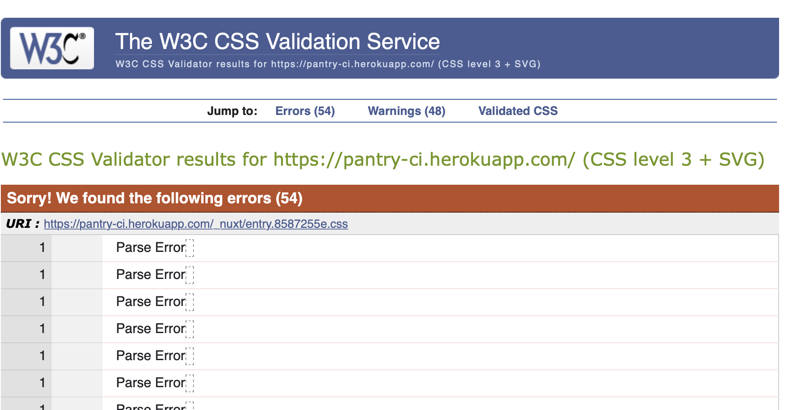
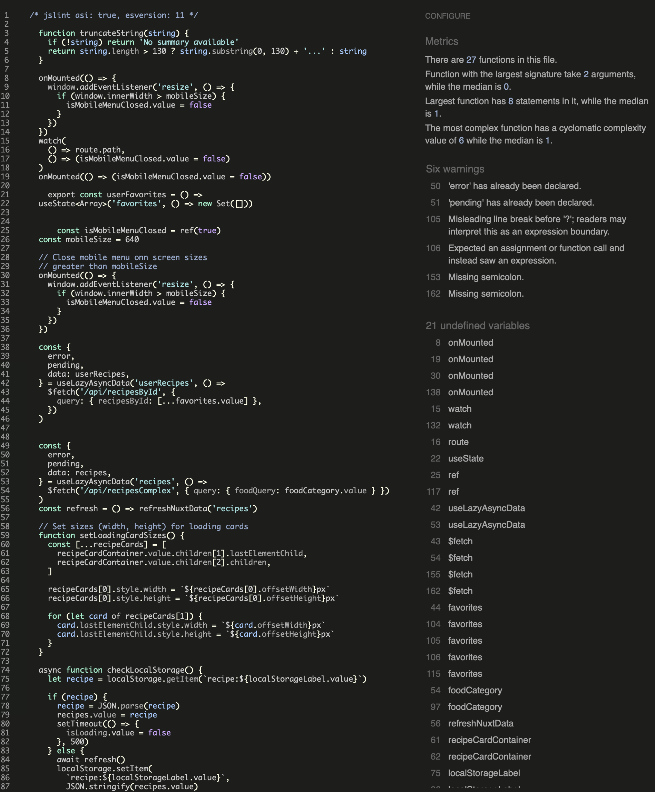

# Pantry


Pantry connects  our users directly with Spoonacular API. View an amazing range of recipes as well as nutritional information. Save your recipes to view later in greater detail, everything from the paleo diet to your favorite chocolate desserts.

---

## **UX** 🎨

### User stories

As a user, customer I would like to the following:

✅ successfully implemented <br>
❌ not yet implemented

- ✅ View recipes & nutritional information.
- ✅ Save favorite recipes.
- ✅ View social media links.
- ✅ View about section to find out more about Pantry.
- ❌ Add persistent storage for user saved recipes (Database for users saved recipes)
- ❌ Add caching layer for improved performance (Memcached or Redis)
- ❌ Improve SEO on site.

#### Typography

- I chose to use default browser fonts & not to use a custom font.

---

## **Features** ✨

### 1. View saved recipe


- Users can view their saves recipe

### 2. View recipe nutritional information


- Users can view recipes in greater detail

### 3. Users can navigate with mobile menu


- Users can view recipes in greater detail

---

## **Future features** 🔮 May 2023

- ❌ Add persistent storage for users favorite recipes
- ❌ Improve SEO (Add open graph meta information).
- ❌ Add account page for users:
  - User can view account information
  - User can view, create & edit own recipes
- ❌ Improve security:
  - Add Content Security Policy (further research needed).
- ❌ Add unit testing & CI workflow (further research needed)

[🔝 Back to Top](add-project-name)

---

## **Technologies** ⚙️

### Web development

- 

  - [Code editor & IntelliSense for VusJs & Tailwind CSS ](https://code.visualstudio.com) 🔗

- 
  - [Used as version control system](https://git-scm.com) 🔗

### Design

- 
  - [Used for designing wireframes](https://www.figma.com) 🔗

### Front-End Technologies

- 

  - Markup language used within VueJS templates.

- 
  - Used to style elements within pages & add transition effects.
- 
  - Used to add reactivity.
  - From validation (client side)
  - Return data based on query parameters

#### Ui Library / CSS framework

- 
  - [Tailwindcss](https://tailwindcss.com/docs/cursor) 🔗 (Used to enhance workflow & improve maintainability of CSS).

#### JavaScript Library

- 
  - [Vue.js](https://vuejs.org) 🔗 (The Progressive JavaScript Framework)
  - Reactivity.
  - Reusable components.

### JavaScript Framework

- [NuxtJS](https://nuxtjs.org/deployments/github-pages) 🔗 (The Intuitive Vue Framework)
  - Used for server side rendering.
  - Enhanced SEO.
  - Image optimization.
  - Code optimization (minified CSS & JavaScript).
  - State management.

### Additional modules to extend NuxtJs 🔌

1. [NuxtJS Modules](https://modules.nuxtjs.org/) 🔗 (Extends NuxtJS functionality)
   - [Nuxt Icon](https://github.com/nuxt-modules/icon) 🔗 Used to generate Icons for project.
   - [Nuxt image](https://image.nuxtjs.org/) 🔗 Used to optimize images for variable screen sizes & convert to [webp](https://developers.google.com/speed/webp) image format.

2. [VueJS devtools](https://chrome.google.com/webstore/detail/vuejs-devtools/nhdogjmejiglipccpnnnanhbledajbpd?hl=en) 🔗 Used to inspect debug VueJS (performance issues & reactivity issues)

[🔝 Back to Top](add-project-name)

---

## Testing 🧪

### 1. Page speed metrics & SEO analytics CSS (ADD SCREENSHOTS)

[Google page speed insight](https://pagespeed.web.dev) (Used for testing performance & SEO) 🔗

Desktop

<details>
<summary>Home page speed test</summary>



</details>

---

### 2. Browser Testing

#### Google Chrome Dev (v.108.0.5343.2)

Used to check for console & API errors, also checked responsiveness for screen widths 300px - 1250px on all pages

> ✏️ **Note**
> 
> knowledge of unit testing is limited, application will need unit testing at later date.

> ℹ️ **INFORMATION**
> 
> NuxtJS & [Vite](https://vitejs.dev/) provide excellent development experience & detailed errors in development.

- Check for JavaScript errors
  1. All known errors resolved in development.

---


### External Validation Testing HTML | CSS | JavaScript

🔥 **Important**
>
> HTML & CSS validation returns 48 CSS parsing errors. This issue is discussed by the maintainer of Tailwindcss & has provided a solution however, 
> I cannot use the recommended fix as I use scoped styles within VueJS. This will break styles used within the application.
> [Remove --tw- variables from universal selector #7317](https://github.com/tailwindlabs/tailwindcss/discussions/7317) 🔗

#### 1. HTML

[W3C Markup Validation](https://validator.w3.org/) 🔗 (Validate HTML)

<details>
<summary>Home page html validation</summary>



</details>

#### 2. CSS

[W3C CSS Validation](https://jigsaw.w3.org/css-validator/#validate_by_upload) 🔗 (Validate CSS)

<details>
<summary>Home page CSS validation</summary>



</details>

#### 3. JavaScript

[JS Hint](https://jshint.com) 🔗 (Validate JavaScript)

I added the following rule to ignore missing semicolons and test for ECMAScript 9 support.

```javascript
/* jslint asi: true, esversion: 11 */
```

<details>
<summary>All pages & components</summary>



</details>

### Development Automated Testing | Linting

🔥 **Important**
>
> NuxtJS auto imports VusJS components, Eslint will display no-undefined warnings, I have yet to find a fix for this.<br>[Nuxt Auto imports](https://v3.nuxtjs.org/guide/concepts/auto-imports) 🔗

VueJS & JavaScript

I added Eslint & Eslint-plugin-vue to validate & check for errors during development as well as follow VueJS best practices based on
[VusJs style guide](https://vuejs.org/style-guide/rules-essential.html). Linting errors are shown in visual studio code terminal.

1. [Eslint Plugin Vue](https://eslint.vuejs.org/)

<br>

[🔝 Back to Top](add-project-name)

---

## Deployment 🚀

> ✏️ **Note**
> 
> This project is currently deployed on Heroku. A planned migration too Cloudflare will take place in January 2023.
> Cold starts on Free Heroku dynos can take a moment to load.

The project is live now @ https://pantry-ci.herokuapp.com 🔗

### Local Deployment 🛠️

> 🔥 **Important**
>
> You will need the following installed on your system 🖥️
> You will also need to sign up to [Spoonacular](https://spoonacular.com/food-api/console#Dashboard) to obtain a api key. After that simply add a .env file and add the following key SPOONACULAR_API_KEY= along with your api key
>
> Note: There is a limit on the free tier which can be met very easily.
> Consider caching responses so you don't surpass the daily limit. 

- [Node JS](https://nodejs.org/en/) LTS version recommended.
- [Yarn](https://yarnpkg.com) or [npm](https://www.npmjs.com)

> ✏️ **Note**
> 
> if you would like to use npm you will need to delete yarn.lock file after cloning the repository

1. Clone repository in desired directory

   - HTTPS
   ```bash
   git clone https://github.com/ciaran-io/pantry.git
   ```

   - SSH
   ```bash
    git clone git@github.com:ciaran-io/pantry.git
   ```

   - GitHub CLI
   ```bash
    gh repo clone ciaran-io/pantry
   ```

   - Download Zip - Click Download Zip option from dropdown from the CODE menu

1. Install project dependencies:

> ✏️ **Note**
>
> This will create a node_modules folder with all the project dependencies

For yarn installation
```bash
yarn install
```

For npm installation
```bash
npm install
```

1. Start development server

> ✏️ **Note**	
> This should open the application on localhost:3000 if port 3000 is free. (Check terminal if in doubt)

For yarn installation
```bash
yarn dev
```

For npm install
```bash
npm run dev
```

> 💁  **Tip**
> 
> If you use Visual Studio Code I recommend installing the following plugins.

- [Tailwind CSS IntelliSense](https://marketplace.visualstudio.com/items?itemName=bradlc.vscode-tailwindcss) 🔗
   > ℹ️ **Information**
- 
  > Tailwind CSS IntelliSense enhances the Tailwind development experience by providing
  > Visual Studio Code users with advanced features such as autocomplete, syntax highlighting, and linting.

- [Vue Language Features (Volar)](https://marketplace.visualstudio.com/items?itemName=Vue.volar)
  > ℹ️ **Information**
  > Fast Vue Language Support Extension

- [Vue VSCode Snippets](https://marketplace.visualstudio.com/items?itemName=sdras.vue-vscode-snippets)
  > ℹ️ **Information**
  > These snippets were built to supercharge a workflow in the most seamless manner possible.

---

### Remote Deployment 🏗

View NuxtJS documentation to view all available supported hosting providers [find out more](https://v3.nuxtjs.org/getting-started/deployment)

#### Deploying using Heroku

1. Create a Heroku [account](https://signup.heroku.com/login) or [log in](https://id.heroku.com/login).

2. Create a new app & select a region closets to you or your audience.

3. Deployment

- From Cli

  1. Create a new Heroku app.
  ```shell
  heroku create myapp
  ```

  2. Configure Heroku to use the nodejs buildpack.
  ```shell
  heroku buildpacks:set heroku/nodejs
  ```

  3. Configure your app.
  ```shell
   heroku config:set NITRO_PRESET=heroku
  ```

  4. Ensure you have start and build commands in your package.json file.
  ```javascript
  "scripts": {
    "build": "nuxt build",
    "start": "node .output/server/index.mjs"
  }
  ```

- In Heroku dashboard

  1. In settings tab in Heroku add the following inside the Config Vars

  | Config Vars  |        |
  | ------------ | ------ |
  | NITRO_PRESET | heroku |
  | SPOONACULAR_API_KEY | YOUR_API_KEY|

  2. Next go to Buildpacks and select Add buildpack then select nodejs.
  3. Finally go to the deploy tab on Heroku & click the GitHub as deployment method. The app will no be
     automatically deploy when you push to GitHub. You can also use the manual deploy option if Heroku did not create a build.

> 💁  Tip** 
> 
>  You can preview the app in a production ready environment.

1. Build the application
```bash
yarn build
```

2. Preview the application in production ( command sets process.env.NODE_ENV to production )
```bash
yarn preview
```

Congratulations you are now ready to successfully deploy the application. 🥳

[🔝 Back to Top](add-project-name)

---

## Credits 💌

### Content 📰

- [Awesome Badges](https://github.com/Envoy-VC/awesome-badges) Used to create markdown badges in README.

### Media 📽️

#### About us banner image.

- [Unsplash @Michelle](https://unsplash.com/@micheile) 
#### Home page banner image.

- [Unsplash Tangerine Newt](https://unsplash.com/@tangerinenewt) 
#### Home page recipe dish image.

- [Unsplash @Anna Pelzer](https://unsplash.com/@annapelzer) 

#### User saved recipe page banner image.

- [Unsplash @S O C I A L . C U T Hire](https://unsplash.com/@socialcut) 

### Acknowledgements 🙏

- [@ Tim](https://github.com/TravelTimN/ci-milestone05-fsfw/blob/main/README.md)
  - My Code Institute mentor.
    - Practical advice ✅
    - kept me on track ✅
    - Can't thank him enough ✅
    - Clear guidance & mentorship ✅


[🔝 Back to Top](add-project-name)
